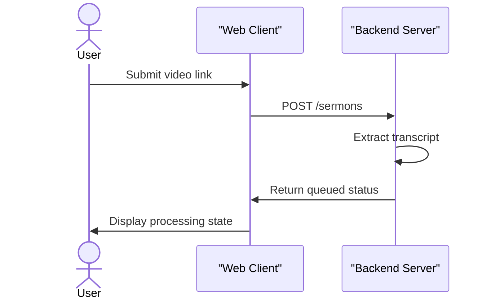
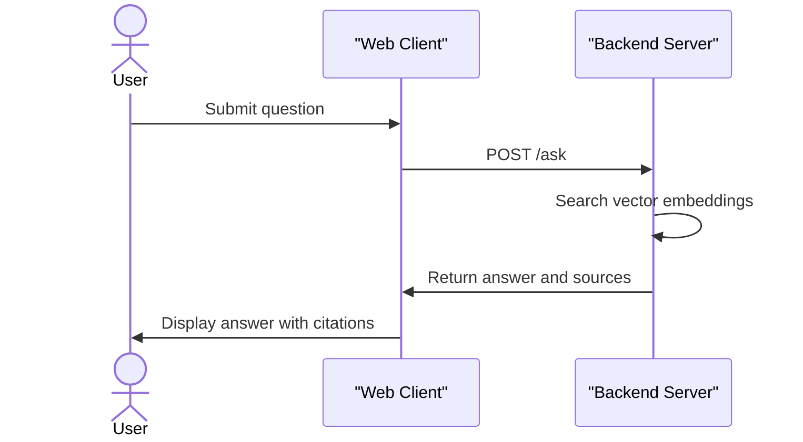

# Logos

Logos helps users turn video teachings into a personal, searchable library of insights. It takes video input, extracts structured takeaways and themes, and allows listeners to search past teachings or ask questions based entirely on their saved content. No complicated organization is needed, just straightforward tools to remember what was taught.

## System Architecture

## Usage

To start using Logos, launch the application and sign in with a Google account. The interface provides a clean sidebar to navigate between your library, semantic search, and the AI question panel. 

Navigate to the "Add Sermon" page and paste a standard YouTube video link. The application will queue the video for background processing. Once processed, the detail page displays AI-generated summaries, key teachings, and scriptural cross-references, along with a dedicated section for your private notes.

## Features

* **Automated Extraction**: Submit a video link and the system automatically reads the transcript to generate a summary, key teachings, and an organized list of themes.

* **Semantic Search**: Look up topics or concepts by their meaning rather than exact keywords. The search engine checks across all processed documents in the user's library and returns a relevance score.

* **Ask Panel**: Ask direct questions about past teachings. The system returns answers grounded exclusively in the saved library and cites the exact source videos used to generate the response.

* **Private Note-taking**: Keep personal reflections directly alongside the generated content. Notes are private and kept visually distinct from the automated analysis.

## Technologies Used

| Category | Technology |
|---|---|
| Framework |  |
| Library |  |
| Styling |  |
| Language |  |

---

